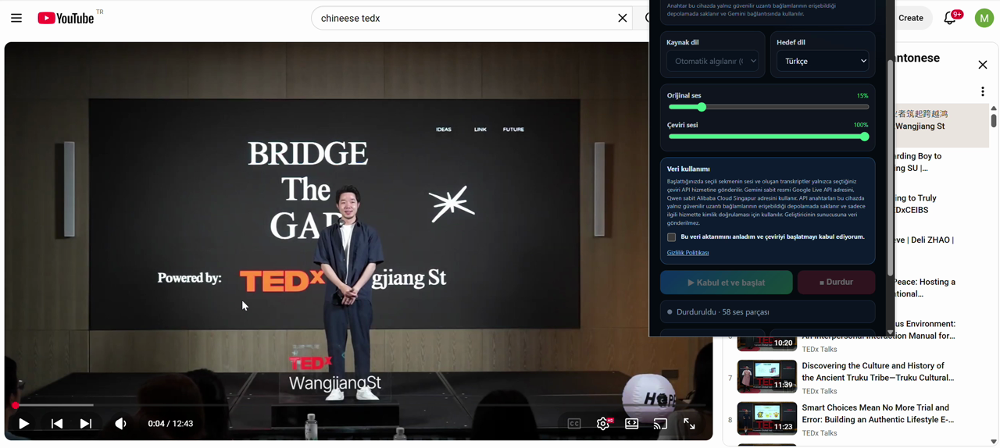

# Youtube Live Voice Translation

A real-time AI translation extension for YouTube. This Chrome (Manifest V3) extension
captures the audio of the currently active tab and translates it live into Turkish or
your chosen target language, using either **Google Gemini Live** or **Alibaba Cloud
Model Studio (Qwen3.5 LiveTranslate)** as the streaming translation backend.

Load Chrome extension from https://chromewebstore.google.com/detail/youtube-live-voice-transl/clhnemjdfadiidfhlgagkogdbcdahjkm?authuser=0&hl=en

  

## Demo

A short clip showing the extension translating live audio in real time:

<p align="center">
  
</p>

<video src="./Demo.mp4" controls width="100%" poster="demo-thumb.png"></video>

## Features

- **Real-time speech translation** of the active tab's audio (e.g. a YouTube video) into
  Turkish or your chosen target language.
- **Two backends to choose from:** Google Gemini 3.5 Live Translate or
  Alibaba Cloud Qwen3.5 LiveTranslate (Real-time voice).
- **Spoken output:** the translation is streamed back as audio in the target language.
- **On-screen transcripts** of both the input and the translation.
- **Full privacy-first design** — see [Privacy](#privacy).

## Requirements

- Google Chrome **116 or later**.
- An API key:
  - **Gemini:** Google AI Studio API key.
  - **Qwen:** Alibaba Cloud Model Studio (Singapore) API key.

> You can use either backend. Whichever key you provide is used for its matching provider;
> the other is optional.

## Installation (Developer Mode)

1. Download or clone this repository.
2. Open Chrome and go to `chrome://extensions`.
3. Enable **Developer mode** (top-right toggle).
4. Click **Load unpacked** and select the project folder.
5. Pin the extension to the toolbar.
6. Click the extension icon, accept the data-transfer consent, and press
   **Accept & Start** on the tab you want to translate.

## Usage

1. Open a video (e.g. on YouTube) and let it play.
2. Click the extension icon in the toolbar.
3. Select your **target language**, **provider/model**, and **audio volume**.
4. Accept the consent and start the session.
5. The audio is translated and voiced in real time; transcripts appear in the popup.

## Backends

### Google Gemini Live
- Model: `gemini-3.5-live-translate-preview`
- Endpoint (fixed, not user-configurable):
  ```
  wss://generativelanguage.googleapis.com/ws/google.ai.generativelanguage.v1beta.GenerativeService.BidiGenerateContent
  ```
- Key: Google AI Studio API key.

### Qwen3.5 LiveTranslate (Alibaba Cloud)
- Model: `qwen3.5-livetranslate-flash-realtime`
- Endpoint (fixed):
  ```
  wss://dashscope-intl.aliyuncs.com/api-ws/v1/realtime?model=qwen3.5-livetranslate-flash-realtime
  ```
- Key: Alibaba Cloud Model Studio (Singapore) API key.
- Supported audio languages include `tr`, `en`, `zh`, `de`, `fr`, `es`, `ar`, `ja`, `ko`,
  `ru`, `it` and many more (see `shared-config.mjs`).

## Project Structure

```
.
├── manifest.json          # Manifest V3 extension manifest
├── background.js          # Service worker: session, secrets, state, routing
├── offscreen.html         # Offscreen document host for audio processing
├── offscreen.js           # Audio capture + WebSocket streaming logic
├── audio-worklet.js       # AudioWorklet processor for audio routing
├── popup.html/.css/.js    # Extension popup UI
├── privacy.html/.css      # Privacy / consent screen
├── shared-config.mjs      # Shared models, endpoints and helpers
├── ui-i18n.mjs            # In-extension UI internationalization (incl. RTL)
├── icons/                 # 16/48/128 px extension icons
└── tests/                 # Node test-runner unit & policy checks
```

## Testing

Unit and store-policy tests use the Node built-in test runner:

```bash
node --test tests/shared-config.test.mjs tests/ui-i18n.test.mjs tests/package-policy.test.mjs
```

(The `browser-ui-smoke.mjs` smoke test drives a real browser and is run separately.)

## Privacy

- Audio capture starts **only** after you accept the data-transfer disclosure and press
  **Accept & Start**.
- Raw audio is never written to disk; it streams directly to the chosen provider over
  **WSS/TLS**.
- **API keys** are stored in `chrome.storage.local`, reachable only by trusted extension
  contexts, and reused until you change, reset, or remove the extension.
- Transcripts and runtime state live only in `chrome.storage.session` and are cleared on
  browser restart.
- Preferences (language, model, volumes) are kept in `chrome.storage.local`.
- Popup labels, field names, descriptions, buttons, statuses and local error messages
  switch instantly to the selected target language (Arabic & Persian use RTL layout).
- **No audio, transcript, or API key is ever sent to the developer's server.**
- The extension injects no content scripts into web pages; status is shown via the
  toolbar badge.

## License

This project is released for personal and educational use. See the repository license
file for details.
